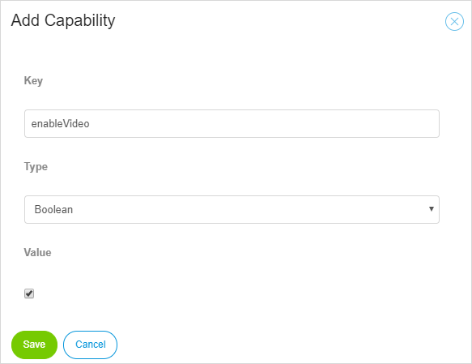
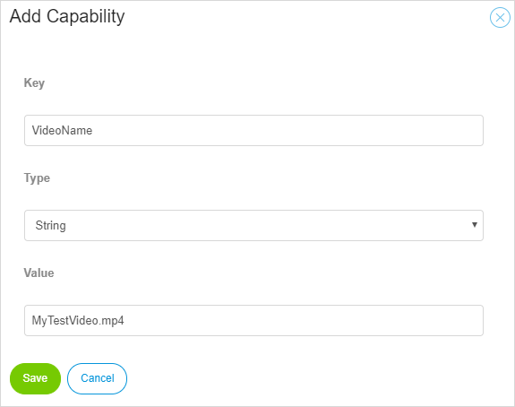
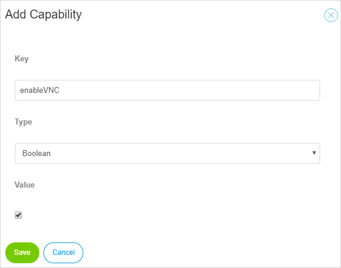
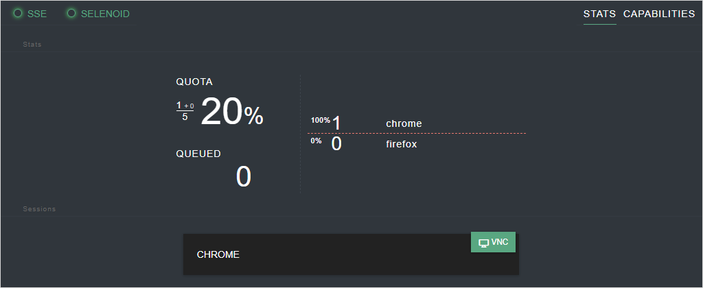
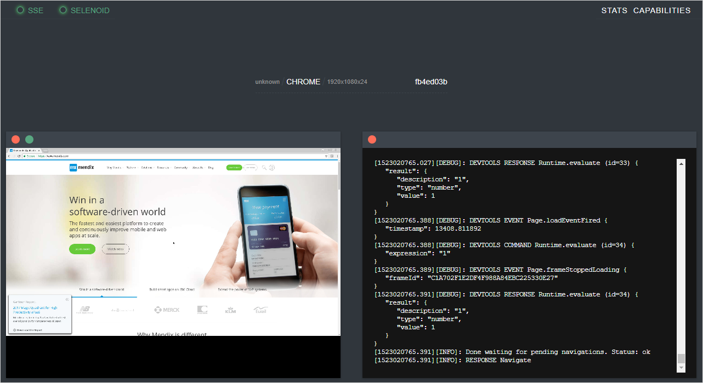

## 1 Introduction

This how-to shows you an example of a simple setup of a Selenoid hub with a Chrome and Firefox node on a Linux machine with docker. This works on a Windows machine with docker as well, but the commands and configuration could be different. For the official project go to: [https://github.com/aerokube/selenoid](https://github.com/aerokube/selenoid). For the official documentation go to: [http://aerokube.com/selenoid/latest/](http://aerokube.com/selenoid/latest/).

It is possible to run Selenoid without Docker, but that is outside of the scope of this how-to. Please check out the official documentation if you would like to achieve this.

{}
 Mendix does not deliver support for local Selenium solutions. 
{}

## 2 Prerequisites

The following components are needed to set up a local Selenoid hub:

* Some basic docker and docker-compose knowledge
* A machine with the latest versions of **docker** and **docker-compose** installed
* Your machine should allow connections from ATS on port 4444

## 3 Installing Your Hub and Nodes with Docker-Compose

The following steps describe how to install the hub and nodes with Docker-Compose:

1. Create a folder or a directory to place your *docker-compose.yml* and *browsers.json* files.
2. Create a folder or directory to place your video files.
3.  Create a *browsers.json* in your folder/directory (/docker)

	```
      {
           "firefox": {
                   "default": "58.0",
                   "versions": {
                           "58.0": {
                                   "image": "selenoid/firefox:58.0",
                                   "port": "4444",
                                   "path": "/wd/hub",
                                   "tmpfs": {"/tmp":"size=512m"}
                           }
                   }
           },
           "chrome": {
                   "default": "65.0",
                   "versions": {
                           "65.0": {
                                   "image": "selenoid/chrome:65.0",
                                   "port": "4444",
                                   "tmpfs": {"/tmp":"size=512m"},
                                   "shmSize" : 1073741824
                           }
                   }
           }
   }
	```

4.  Create a docker-compose.yml in your folder/directory (/docker)

	```
   version: '3'
   services:
     selenoid:
       network_mode: bridge
       image: aerokube/selenoid
       volumes:
         - "/docker:/etc/selenoid"
         - "/var/run/docker.sock:/var/run/docker.sock"
         - "/docker/video:/opt/selenoid/video"
       environment:
         - OVERRIDE_VIDEO_OUTPUT_DIR=/opt/selenium/video
         - TZ=Europe/Amsterdam
       command: ["-conf", "/etc/selenoid/browsers.json", "-video-output-dir", "/opt/selenoid/video"]
       ports:
         - "4444:4444"
	```

5.  Open a console and give the following commands to pull the images first:

	```
   sudo docker pull selenoid/chrome:65.0
   sudo docker pull selenoid/firefox:58.0
   sudo docker pull selenoid/video-recorder
   sudo docker pull aerokube/selenoid
	```

6.  Open a console and give the following command from the folder/directory where you placed your docker-compose.yml:

	```
	sudo docker-compose up -d
	
	Starting docker_selenoid_1 ... done
	```

7.  After it started, you can check the status of the container

	```
	sudo docker-compose ps
         Name                     Command               State           Ports         
   ---------------------------------------------------------------------
   docker_selenoid_1   /usr/bin/selenoid -conf /e ...   Up      0.0.0.0:4444->4444/tcp
	```

8.  To check the status of the hub:

	```
	curl -s http://localhost:4444/status

	{"total":5,"used":0,"queued":0,"pending":0,"browsers":{"chrome":{"65.0":{}},"firefox":{"58.0":{}}}}
	```

## 4 Starting Testing

You can start testing by sending your test script to: `http://yourmachinenameorIP:4444/wd/hub`.  Make sure it is reachable from the outside!

## 5 Recording a Video of Your Test Case

In case you want to record your test case as a video follow these steps:

1.  Add a Custom Capability to your Selenium hub configuration: **enableVideo** with a Boolean set to **true**

	

2. Once the test case finishes you can find your video in: `http://yourmachinenameorIP:4444/video`. The video shows as "session-id.mp4"
3.  (Optional:) You can give the video file a custom name by adding another Custom Capability: **VideoName** with a string, for example **MyTestVideo.mp4** (don't forget the .mp4!)

	

After executing the test case, don't forget to download the video file or give it a different name in the next session, otherwise it is overwritten!

## 6 Optional: Installing a Hub with a Portal with "Live-View"

To install a hub with a Portal for "Live-View" you need a different *browsers.json* and *docker-compose.yml* file. To add a "Live-View" follow these steps:

1.  Create a *browsers.json* with VNC browser image:

	```
   {
           "firefox": {
                   "default": "58.0",
                   "versions": {
                           "58.0": {
                                   "image": "selenoid/vnc:firefox_58.0",
                                   "port": "4444",
                                   "path": "/wd/hub",
                                   "tmpfs": {"/tmp":"size=512m"}
                           }
                   }
           },
           "chrome": {
                   "default": "65.0",
                   "versions": {
                           "65.0": {
                                   "image": "selenoid/vnc:chrome_65.0",
                                   "port": "4444",
                                   "tmpfs": {"/tmp":"size=512m"},
                                   "shmSize" : 1073741824
                           }
                   }
           }
   }
	```

2.  Create a docker-compose.yml with added selenoid UI for the portal:

	```
   version: '3'
   services:
     selenoid:
       network_mode: bridge
       image: aerokube/selenoid
       volumes:
         - "/docker:/etc/selenoid"
         - "/var/run/docker.sock:/var/run/docker.sock"
         - "/docker/video:/opt/selenoid/video"
       environment:
         - OVERRIDE_VIDEO_OUTPUT_DIR=/docker/video
         - TZ=Europe/Amsterdam
       command: ["-conf", "/etc/selenoid/browsers.json", "-video-output-dir", "/opt/selenoid/video"]
       ports:
         - "4444:4444"

     selenoid-ui:
       image: "aerokube/selenoid-ui"
       network_mode: bridge
       links:
         - selenoid
       ports:
         - "8080:8080"
       command: ["--selenoid-uri", "http://selenoid:4444"]
	```

3.  Pull the images first

	```
   sudo docker pull selenoid/vnc:chrome_65.0
   sudo docker pull selenoid/vnc:firefox_58.0
   sudo docker pull aerokube/selenoid-ui
	```

4.  Start the hub

	```
    # sudo docker-compose up -d

    Creating docker_selenoid_1 ... done
    Creating docker_selenoid-ui_1 ... done

    sudo docker-compose ps

            Name                      Command               State           Ports         
    --------------------------------------------------------------------------------------
    docker_selenoid-ui_1   /selenoid-ui --selenoid-ur ...   Up      0.0.0.0:8888->8080/tcp
    docker_selenoid_1      /usr/bin/selenoid -conf /e ...   Up      0.0.0.0:4444->4444/tcp 
	```

5. You can visit your portal on [http://yourmachinenameorIP:8080](http://localhost:8080)
6.  To enable "Live-View" you need to add another Custom Capability to your Selenium hub configuration: **enableVNC** with Boolean set to **true**

	

7.  After starting your test case you can view your session in the portal:

	

8.  By clicking on your session, you will be able to see your live view:

	

Congratulations you have finished setting up a local Selenoid hub. The next how-to is  [Use ATS in Combination with CI/CD](ht-two-ats-and-ci-cd). You find an overview of all the how-tos and the structure on the [ATS 2 How-to's](ht-two) page. We advise you to follow the predefined structure.
