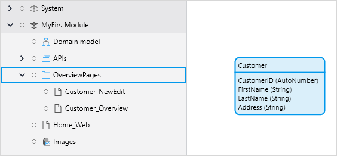
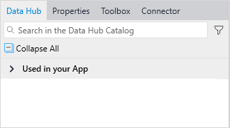
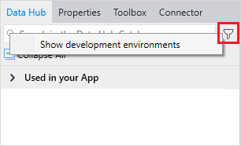
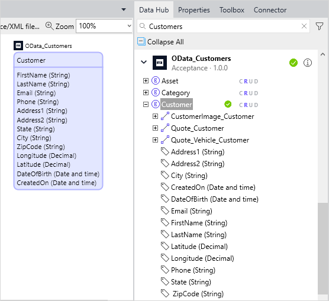

## 1 Introduction

This how-to will demonstrate how easy it is to build apps using data from different sources using Mendix Data Hub. The steps describe the following: 

* Create a simple app in Mendix Studio Pro
* Publish an entity from the app and register it in the Data Hub Catalog 
* Use the Data Hub Catalog to explore the data sources from the organization that are registered as assets 
* Connect to the registered asset that you published earlier and use it in a new app
* Change data in the original app and see it updated in the new or consuming app
* See the network of shared data in the Data Hub Landscape

{}
To use the Mendix Data Hub a license is required. The license enables you to discover all the shared assets that are registered in your organization and also use the Data Hub integration in Studio Pro to consume the shared datasets for building apps. For more information, see the [Data Hub License Limitations](/refguide/consumed-odata-service-requirements#license-limitations) section of *Consumed OData Service Requirements*.
{}

## 2 Prerequisites

Before starting this how-to, make sure you have completed the following prerequisites:

* Install Mendix Studio Pro version [8.14.0 or above](https://marketplace.mendix.com/link/studiopro/)

## 3 Creating an App {#createapp} 

Follow these steps to create a simple app in Mendix Studio Pro. 

1. In Studio Pro, click **New App** to create a new app using the **Blank** app template. Fill in the **App Name** as *{yourname}CustomerServiceApp* and select **Create app**. 

2. In the App Explorer, double-click the **Domain Model** in **MyFirstModule**. 

3. In the **Toolbox**, select **Entity** and drag and drop it to the domain model.

4. Double-click the entity to open its properties and set its **Name** to *Customer*.

5. In the **Attributes** tab, click **New** and do the following:
    1. In the **Add Attribute** dialog box, set **Name** to *CustomerID* and set to **Type** to *Autonumber*.
    2. Click **OK** to create the attribute.
    
6. Repeat steps 5a and 5b to create attributes *FirstName*, *LastName*, *CompanyName*, *Address* and set type to *String* for all of them. 

	
	
7. Click **OK** to save your changes.

8. Right-click the entity and select **Generate overview pages** from the drop-down list.

9. In the **Generate pages** dialog box, make sure **Atlas_Default (Atlas_Core)** is selected as the **Content layout** and click **OK**. 

10. In the **Information** pop-up dialog, click **OK**. 
    Overview pages for the new entity are added in the **OverviewPages** folder of **MyFirstModule**.

	

11. In the **App Explorer**, double-click **Home_Web** to open the **Home_Web** page.

12. From the **App Explorer** drag **Customer_Overview** into the empty **Auto-fill** container under the *Home* banner.

You have created a simple app with the entity **Customer**, and a web page where we can view and edit details for this entity. 

Go ahead and customize the homepage further by changing the banner text.

## 4 Publishing to the Data Hub Catalog {#publishing}

You need to register the **Customer** entity in the Data Hub Catalog to use this entity in other apps. To do this, you need to expose the **Customer** entity in a *Published OData service* in Mendix Studio Pro. OData v3 and OData v4 are REST-based protocols and standard formats for registering services in the Data Hub Catalog. 

Do the following:

1.  In the App Explorer, right-click **MyFirstModule**. From the drop-down list, select **Add a folder**. Name it  *APIs*.

	{}The published OData service functions as an API to your app. Some apps may have several published services, so it is good practice to keep them together in a folder for each module.{}

2.  In the **Domain Model**, right-click the **Customer** entity and select **Expose as OData resource…**.

	

3.  In the **Select Published OData Service** dialog box, select the **MyFirstModule** > **APIs** folder and click **New** to add a new OData service to this folder.

	
	
4. Name the published OData service *{yourname}CustomerODataService* and click **OK**.

    The new **{yourname}CustomerODataService** is added to the module and the **Edit published resource** dialog box is displayed for the entity **Customer**. 

    

    {}  Make a note of the the **Exposed set name**. This defaults to the **Exposed name** with an "**s"** added to the end. When the service is registered in the Data Hub Catalog, the **Exposed set name** will be displayed as the available **Dataset**. {}
    
5. Click **OK** twice to display the **OData Service** document that will be registered in the Data Hub Catalog. In the **General** tab, notice the **Version** number. 

	

	Under **Entities**, the **Customer** entity is listed. The details of the entity are displayed on the right. To expose more entities in the service, add them on this page.

6. Click **Publish** in the top bar to deploy the app and publish it. When prompted, click **Save and continue** to save any unsaved changes to the app.     

7. The app is deployed, and the OData service is automatically registered in the Data Hub Catalog. Click **View App** to open the app in a browser. 

8. On the app's home page, click **Customers Overview**.

9. Add data to the app. Click **New** to add data for a customer entry.

    

  When this entity set is consumed by another app via the Data Hub Catalog, the other app will see the data entered here.

## 5 Using the Data Hub Catalog and Curating Your Own Service {#use-and-curate}

The **{yourname}CustomerODataService** from your app is now registered in the Data Hub Catalog. The data can be used in other apps. The service is called a **Data Source** in the Catalog, and the exposed **Customer** entity is a **Dataset**.

Do the following:

1.  Go to [Mendix Data Hub](https://hub.mendix.com/):

	

2. In the search field, enter the search term *{yourname}*. All services and datasets that satisfy this search string are displayed in the **Search Results** pane in the **Search Details** screen. However, the service does not appear in the **Search Results** yet, as by default, a filter is set to show results in **Production** environments.

3. In the panel on the left, click **Filter** to see the **Filters** dialog box.

4. Your app was deployed to the **Mendix Free App** or **Sandbox** environment. Check **Sandbox** to include it in the search results, then click **Apply**:

    

5. From the new search results list on the left, select the *{yourname}CustomerODataService* service. Full details from the OData contract for the service are displayed on the right.

6. The **Curate** bar confirms that "**You are the owner of this data source**". You have permissions edit the metadata for this service in the Catalog and a **Business Owner**.

	

	{}For more information about roles in Data Hub, see [Roles in Data Hub](/data-hub/#data-hub-roles).{}

For more details on searching in the Data Hub Catalog and the **Search Details** screen, see [How to Search in the Data Hub Catalog](/data-hub/data-hub-catalog/search). You can also explore registered services in the Data Hub Landscape. For more information, see [How to Use the Data Hub Landscape](/data-hub/data-hub-landscape/).

## 6 Using the Customer Dataset in Another App

You are going to create a second app and consume the **Customer** dataset from the **{yourname}CustomerODataService** service.

To do this, follow the steps below:

1. In Mendix Studio Pro, create a new app using the **Blank** app template and call it *{yourname}CustomerActionsApp*.

2. Go to the domain model > **Data Hub** pane:

	

	If you do not see the **Data Hub** pane, click **View** > **Data Hub** to display it:
	
	
3. In the [Data Hub](/refguide/data-hub-pane) pane, enter the search string *{yourname}*.

4. By default, search in the **Data Hub** pane only shows services in **Production** environments. Your app was deployed as a **Sandbox** app. Click the **Filter** icon next to the search and check **Show development environments**.

    

    The search results now include **{yourname}CustomerOData_service** from your Mendix Cloud **Sandbox** environment.

5.  From **{yourname}CustomerODataService**, drag and drop the **Customer** entity into the domain model. The consumed service and entity have green checkmarks in the **Data Hub** pane now.

6. This entity is different from the blue entity container from the first app. This purple colored entity is called an *external entity*. The name of the OData service it is exposed in is displayed above it.

    

    {}For further information on external entities, see [External Entities](/refguide/external-entities) in the *Studio Pro Guide*.  {}

    Click the information icon for the consumed service in the **Data Hub** pane to see further information about the service, and follow the link to **View in Data Hub Catalog**.

7. In the **App Explorer**, notice the service and location documents for your external entity. These documents specify the metadata for the service and provide the links for connecting to the shared data.

8. Right-click the entity and select **Generate overview pages** for this entity. In the **Generate pages** dialog box, for **Content layout** select **Atlas_Default(Atlas_Core)** and click **OK**. Accept the **Information** box by clicking **OK**. Overview pages for the new entity are added in the **OverviewPages** folder of **MyFirstModule**.

9. From the App Explorer, drag **Customer_Overview** into the empty **Auto-fill** container under the *Home* banner.

10. Click **Publish** to deploy the app and pull in the data you added to the **Customer** entity in the publishing app (**{yourname)CustomerServiceApp**) through the **{yourname)CustomerODataService**.

## 7 Viewing the Shared Data in Your New App 

To view the consumed data in your new app, follow these steps:

1. When the app has successfully been deployed, click **View App** to open the app in the browser.
2. Click **Customer Overview**.

	The overview page displays the list of the customers that you entered in the **{yourname}CustomerServiceApp** app. The data is shared from another app, so there are no options for adding or changing the data.

## 8 Seeing Changes in Data in the Consuming App

To see an example of consumed data being updated when data is changed in the originating app, follow these steps:

1. Make sure both apps are published in Mendix Studio Pro, then open both apps in separate browser windows. 
2. Make a change to the customer list in **{yourname}CustomerServiceApp**, such as adding a few more customers or editing some existing entries.
3. Refresh the **{yourname}CustomerActionsApp** window by doing a **Search** to see the changes in the data displayed. 

Congratulations, you have successfully used the Data Hub to share data between Mendix apps! You can now see your new apps in your Data Hub Landscape. 

## 9 Viewing Your Apps in the Data Hub Landscape

You can view the two apps that you have created in the Data Hub Landscape and see how they are connected:

1. Open the [Data Hub](https://hub.mendix.com/#/home) home page.
2. Find your service using the search pane. Remember to use the filter to ensure you can see **Sandbox** apps. 
3. Click the **Landscape** tab to see a visual representation of your apps (rounded squares), services (circles), and connections (lines). The number of entity sets/datasets that have been exposed appears beneath the service. 
    

    The service **{yourname}CustomerODataAPI** is linked by a solid line to the running instance of **{yourname}CustomerCustomerServiceApp**, which is deployed as a Free App.

    The service is also linked by a dotted grey line to **{yourname}CustomerActionsApp**. The arrow indicates that **{yourname}CustomerActionsApp** is making a call to **{yourname}CustomerODataAPI** for data. If you click on **1 Dataset** on this dotted line, the datasets that are being consumed will be listed in the metadata panel on the right.
