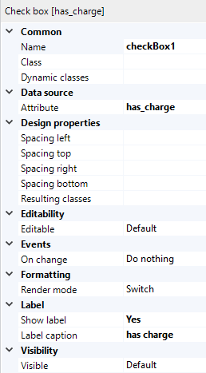

## 1 Introduction

A **check box** is used to display and, optionally, allow the end-user to edit the value of an attribute of [data type](data-types) *Boolean*. It displays a tick if the value is true and remain empty if it is false. 

{}In native mobile applications, the check box widget can be rendered as either a switch (default) or a checkbox. If checkbox, it displays a tick if the value is true and remains empty if it is false. If switch, it displays a track with right-positioned thumb button if the value is true and a left-positioned thumb button if it is false.{}

A check box must be placed in a [data widget](data-widgets) and displays an attribute of the object(s) retrieved by that widget. The name of the attribute to be displayed is shown inside the check box widget, between square brackets, and colored blue.

For example, this check box allows you to see, and set, whether someone is subscribed to your newsletter.

## 2 Properties

An example of check box properties is represented in the image below:

{}
{}

Check box properties consist of the following sections:

* [Common](#common)
* [Data source](#data-source)
* [Design Properties](#design-properties)
* [Editability](#editability)
* [Events](#events)
* [Formatting](#formatting)
* [Label](#label)
* [Visibility](#visibility)

### 2.1 Common Section{#common}

{}

### 2.2 Data Source Section{#data-source}

{}

### 2.3 Design Properties Section{#design-properties}

{} 

### 2.4 Editability Section{#editability}

{}

### 2.5 Events Section{#events}

#### 2.5.1 On Change{#on-change}

The on-change property specifies an action that will be executed when leaving the widget, either by using the <kbd>Tab</kbd> key or by clicking another widget, after the value has been changed.

{}

#### 2.5.2 On Enter

The on-enter property specifies an action that will be executed when the widget is entered, either by using the <kbd>Tab</kbd> key or by clicking it with the mouse.

{}

#### 2.5.3 On Leave

The on-leave property specifies an action that will be executed when leaving the widget, either by using the <kbd>Tab</kbd> key or by clicking another widget.

This differs from the [On change](#on-change) property in that the event will always be triggered, even if the value has not been changed.

{}

### 2.6 Formatting Section{#formatting}

The render mode property determines whether the widget renders as a switch or a checkbox.

### 2.7 Label Section{#label}

{}

### 2.8 Visibility Section{#visibility}

{}

## 3 Read More

*   [Data view](data-view)
*   [Attributes](attributes)
