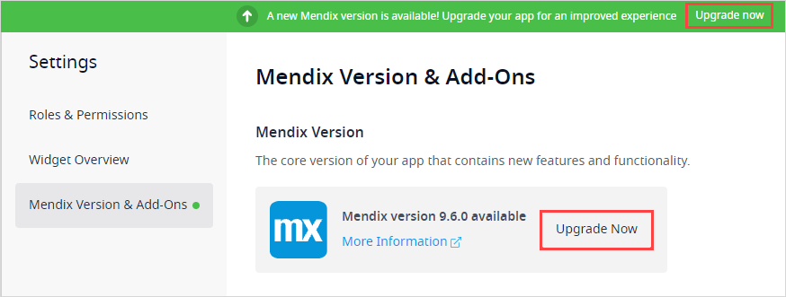

## 1 Introduction

The **Mendix Version & Add-Ons** screen provide information on the Mendix version and add-on modules your app currently has and allows you to upgrade them when a newer version is available. You may want to stay up-to-date to have the latest features, issue fixes, and security updates. 

The Mendix version is the core version of your app that contains main features and functionality. For more information on Mendix and Studio versions, see [Studio Ranges & Mendix Versions](general-versions).

Your Mendix app consists of *modules* that divide functionality of your app into separate parts. For example, you have a default MyFirstModule where you can start building your own functionality. On the **Mendix Version & Add-Ons** screen, you can see *add-on modules* that contain specific platform capabilities used in the app. An add-on module provides additional content to certain features, such as security or workflows. For example, the Mendix SSO module allows your end-users to sign into the app with their Mendix credentials; this module provides content for security. 

{} 

Version upgrades and add-on updates come into effect after you publish your app.

{} 

## 2 Upgrading to the New Mendix Version 

When a new Mendix version comes out, you see a green dot next to the **Settings** icon and the **Mendix Version & Add-Ons** screen in the menu bar (in addition to the top bar that is displayed in Studio). Click the **Upgrade Now** button to upgrade to the next version.

For more information on the upgrade, see the [Upgrading to the Next Version](general-versions#upgrade) section in *Studio Ranges & Mendix Versions*.

{} 

Once you have upgraded to the newest version, you cannot revert the upgrade. Also, anyone working on the app using Studio Pro must use the new version of Studio Pro from that moment on.

{}    

## 3 Updating Add-Ons

Once there is a new version of an add-on module that is compatible with your app, you see a green dot next to the **Settings** icon the **Mendix Version & Add-Ons** screen in the menu-bar. Open the **Mendix Version & Add-Ons** screen and click the **Update** button next to the add-on module. 

Modules can be dependent on each other: one module might need other modules to function properly, or one version of a module might require a specific version of the module it depends on. For example, the workflow-specific module Workflow Commons requires the Atlas Core module and it requires Atlas Core to be no lower than version 3. Studio detects such dependencies automatically and notifies you about them, so no additional action is required from you, all dependencies are handled automatically:

{}

{}

## 4 Read More

* [Studio Ranges & Mendix Versions](general-versions)
